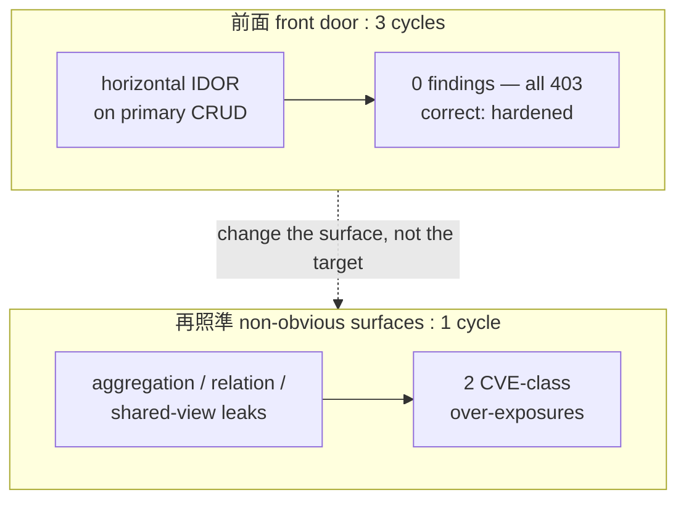
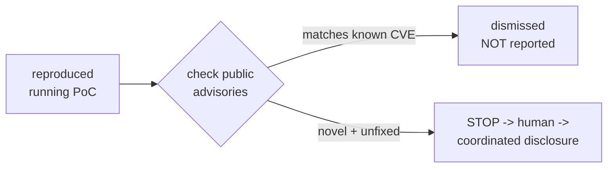

AI 支援の脆弱性リサーチには、派手な "0-day を見つけた" の前に、地味だが決定的な工程がある。「本当にそれは新規で、実在する欠陥なのか」を確かめる工程だ。この記事は、認可（authorization）だけに土俵を絞った検査ハーネスを成熟 OSS 3つに当て、非自明な面で実在の CVE 級バグを黒箱再発見し、そして——それが既に修正済みの公開 CVE だと分かって報告を見送った、その一部始終の記録である。exploit は載せない。載せるのは方法と、公開済みの CVE 番号だけだ。

## 1. 作ったもの——認可を土俵にした検査ハーネス
3つの部品でできている。(a) deny-by-default の egress scope-lock（許可された宛先以外への通信を機構的に拒否する）、(b) 人間の承認をデータ層で強制する append-only の記録基盤（脆弱性の "確定" は LLM でなく人間ゲートを通す）、(c) "自動化してよい工程 / 人間に残す工程" を分けた協調的脆弱性開示(CVD)パイプライン。この上で、自ホストした OSS を、自分の2アカウント（self-A / self-B）の差分で黒箱テストする。攻撃的な偵察（無認可スキャン・被害者探し）は一切しない。触るのは自分が単一占有する自ラボだけ・データは合成のみ。

## 2. まず、正直な非成果
最初に成熟 OSS 3標的（タスク管理2版＋no-code DB）の「主要 CRUD の水平 IDOR」——"B が A の object を id で読めるか"——を系統的に潰した。結果は全部 403、finding ゼロ。これは失敗ではなく正しい結果だ。人気 OSS が最も硬化させているのはこの"前面"だから。重要なのは、ここで「何も無かった」と正直に記録できること。緑（テストが通ること）は動作を意味しない。A-control（正規権限）で毎回 200＋既知データを先取りし、偽陽性を潰したうえでの "非成果" だから、後の主張が信頼できる。

## 3. 照準を変える——標的選定より "狙う面"
仮説はこうだ。実在の認可バグは、per-object の権限チェックを"通らない別コードパス"にいる。集計（group by）、関係の展開（linked records / lookup）、派生的な read（export・通知・フィード）、そして"意図した共有"（shared view）の漏れ。前面が硬いなら、標的を変えるのではなく、狙う"面"を変えるべきだ。

## 4. 再照準の初回で当たった
no-code DB の public shared-view に照準を合わせた1サイクルで、黒箱差分テストが2つの over-exposure を再現した。ひとつは、ビューで非表示にした列の値が集計 endpoint 経由で生のまま返ること。もうひとつは、共有していない関連テーブルのレコードが関係展開 endpoint 経由で返ること。決め手は不整合だった——主経路（通常の行取得 API）は、列非表示を厳格に強制していた。"主経路は守るのに、補助的な endpoint は守らない"。これは仕様上の装飾ではなく、ACL 迂回の署名だ。

## 5. そして、自分の発見を捨てた
ここが本題だ。"0-day を見つけた"と叫ぶ前に、公開 advisory を照合した（対象には触れず、公開情報だけを読む）。結果、再現した2つは既に **CVE-2026-47378**（隠し列の集計経由露出・関連データ越境）と **CVE-2026-47279**（公開 shared-view の関係 endpoint が列の可視性を検証しない）として公表され、修正済みだった。さらに、テストした instance は配布チャネルのラグで修正前のコードを走らせていたことを、版とビルドの差分で決定論的に確認した。∴ これは新規の 0-day ではなく、既知 CVE の（未更新な版での）再現にすぎない。だから報告しない——公表済み・修正済みの CVE を "新発見" として送るのは、重複ノイズであり、規律違反だ。dismissed として正直に記録した。

## 6. 教訓——bug count でなく judgment
2つのことが同時に言える。第一に、この手法は実在の CVE 級の認可バグを、理論が予測した非自明面（集計・関係展開）で黒箱再発見できた。3つの"前面"サイクルでは何も出ず、1つの"再照準"サイクルで CVE 級が2件。照準（judgment）が効いた。第二に、そしてこれが本当に重要なのだが——"再現した ≠ 新規" を自分で見抜き、過大主張を止めた規律。AI 支援リサーチが信頼に足るのは、派手さでなく、叫ぶ前に確かめるからだ。

## 7. 載せないもの（明示）
exploit も PoC も載せない。対象の本番には触れていない（自ホストの合成ラボのみ）。公開するのは方法と、公開済みの CVE 番号だけ。未修正・未開示の脆弱性は、この記事には一切含まれない。

---

派手な発見の物語はどこにでもある。稀なのは、"見つけた気がしたものを、確かめて、捨てる" 物語のほうだ。自動化が強力になるほど、この規律の価値は上がる。
